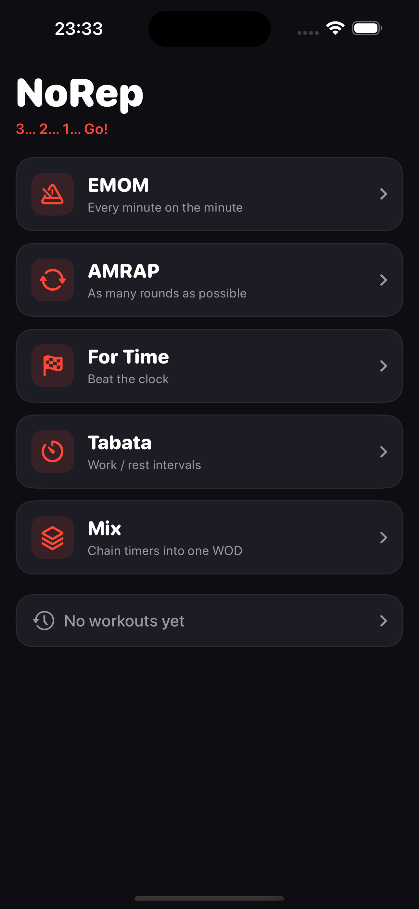
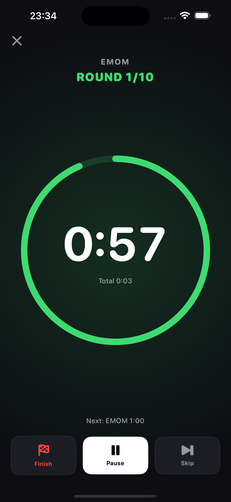
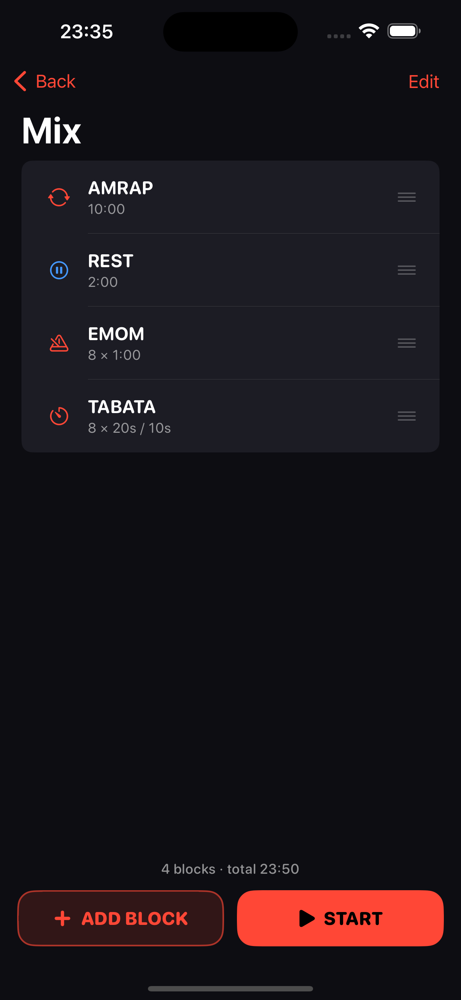

# NoRep

**3… 2… 1… Go!** — a no-nonsense WOD timer for iOS. EMOM, AMRAP, For Time, Tabata, and a Mix builder that chains them into one workout.

<p>
  
  
  
</p>

## Features

- **EMOM** — every minute (or any interval) on the minute, up to 99 rounds
- **AMRAP** — tap the dial to count rounds
- **For Time** — count-up with an optional time cap
- **Tabata** — classic 8 × 20/10 or custom work/rest
- **Mix** — chain any blocks (plus rest) into a single WOD, with per-block movement notes
- **Workout notes on the timer** — the WOD text stays on screen so you always know what's next
- **Round splits** — every round tap is timestamped; see your pace fade (or not) on a chart
- **Journal** — calendar heatmap, day streak, week/month counters, time under the clock
- **PR tracking** — name a workout (Fran, Murph…) and NoRep compares attempts and celebrates new PRs
- **Live Activity** — countdown on the lock screen and in the Dynamic Island; cues keep firing in background
- **Apple Watch app** — timer on the wrist with haptic cues, HKWorkoutSession (counts toward rings), round tapping, results sync to the iPhone journal
- **My WODs** — save any workout as a reusable template from setup, the mix builder, or right after finishing
- **iCloud sync** — journal and saved WODs follow you to a new phone (CloudKit-backed SwiftData)
- **Journal export** — CSV or JSON straight from the journal
- **Benchmark library** — 25 named WODs (The Girls + Hero WODs) as one-tap presets with best-result tracking
- **Quick start** — repeat your last workout or fire a preset right from the home screen
- **Voice announcements** — "Round 5", "Halfway", "Rest" via system speech, in your language
- **Share cards** — post a dark result card (time, score, splits, PR badge) straight to stories
- **Apple Health** — optional; finished workouts count toward your rings
- **7 languages** — English, Русский, Српски, Español, Deutsch, Français, Português (BR)
- **Sound packs** — six sets from classic beeps to air horn and 8-bit arcade, with in-app preview
- **Alternate app icons** — Classic, Blaze, Chalk, Blackout, Gold
- Loud 3-2-1 / GO sound cues (audible over music, even in silent mode), haptics, phase-colored UI. No account, no analytics, no ads.

## Tech

- SwiftUI, iOS 17+
- Clean Swift (VIP): every scene is Models → Interactor → Presenter → ViewStore → Router, wired by a scene factory
- Wall-clock-anchored `TimerEngine` — pause-exact, survives backgrounding
- Project generated with [XcodeGen](https://github.com/yonaskolb/XcodeGen)

## Build

```bash
brew install xcodegen
xcodegen generate
open NoRep.xcodeproj
```

Or from the CLI:

```bash
xcodebuild -project NoRep.xcodeproj -scheme NoRep \
  -destination 'platform=iOS Simulator,name=iPhone 15 Pro' build
```

### Screenshot automation

Debug builds accept a `-DemoRoute` launch argument that opens a scene with demo data
(`workout-emom`, `workout-tabata`, `workout-sprint`, `mix`, `setup-tabata`, `history`):

```bash
xcrun simctl launch <udid> com.norep.app -DemoRoute mix
```

## App Store assets

`AppStore/` contains ready-to-upload screenshots (6.7"), metadata drafts in English
and Russian, and the privacy policy page.
